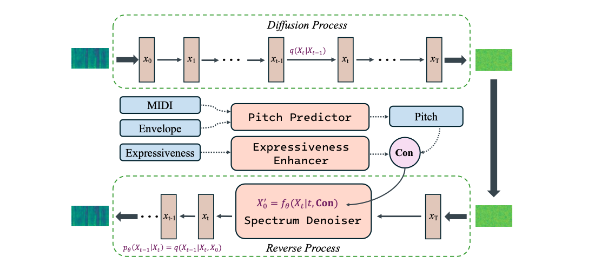

# ConTuner: Singing Voice Beautifying with Pitch and Expressiveness Condition

<p align="center">:construction: :pick: :hammer_and_wrench: :construction_worker:</p>

## Abstract
Singing voice beautifying is a novel task that is widely used in practical scenarios, aiming to correct the pitch of the singing voice and improve the expressiveness without changing the timbre and content. Existing methods rely on paired data or only concentrate on the correction of pitch. We propose a fast and high-fidelity singing voice beautifying system called CONTUNER, a diffusion model combined with modified condition to generate beautified Mel-spectrogram, where the modified condition is composed of optimized pitch and expressiveness. For pitch correction, we establish a mapping relationship from MIDI, spectrum envelope to pitch. To make amateur singing more expressive, we design an expressiveness enhancer in the latent space to convert amateur vocal tone to be professional.

 

## Directions
```
condition.py involves the processes of training and inference.
diffusion.py involves the backbone of the Generator and condition Diffusion.
net.py involves Pitch Predictor, Mel-Spectrogram Denosier.
```

## Citation
If this repository helps your research, please cite it as,
Bibtex:  
```
@inproceedings{wang2024contuner,
  title={CONTUNER: Singing Voice Beautifying with Pitch and Expressiveness Condition},
  author={Wang, Jianzong and Li, Pengcheng and Zhang, Xulong and Zhang, Yong and Cheng, Ning andXiao, Jing},
  booktitle={2024 International Joint Conference on Neural Networks},
  pages={1--6},
  year={2024},
  organization={IEEE}
}
```   

or with a [hyperlink](https://github.com/PecholaL/ConTuner)  
Markdown: `[ConTuner](https://github.com/PecholaL/ConTuner)`  
Latex: `\href{https://github.com/PecholaL/ConTuner}{\textsc{ConTuner}}`